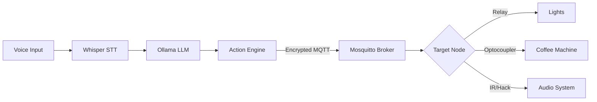

# Metis

Local-first, privacy-centric AI home system. Orchestrates a secure, encrypted communication layer between a central intelligence (MacBook M3/Ollama) and distributed hardware nodes (ESP32). Designed to automate lighting, household appliances like the DeLonghi Dinamica, and vintage audio equipment without any cloud dependency.

**Work in Progress**

---

## Demo

> *Screenshots coming once the dashboard and physical nodes are active*

---

## Tech Stack

| Component | Technology |
|---|---|
| Brain (LLM) | Ollama · Llama 3.1 8B |
| Speech-to-Text | Whisper · whisper.cpp (optimized for Apple Silicon) |
| Text-to-Speech | Piper TTS |
| Message Broker | Mosquitto MQTT · TLS 1.3 encryption |
| Logic & Engine | Python 3.12+ |
| Microcontroller | ESP32 · MicroPython |
| Infrastructure | Docker · Docker Compose |

---

## Project Structure
```text
metis/
├── .github/
│   └── workflows/
│       ├── ci.yml                # Linting and code quality
│       └── docs.yml              # Automated documentation and diagrams
│
├── infra/                        # Infrastructure-as-Code
│   └── mosquitto/                # MQTT Broker setup
│       ├── config/               # passwd, acl, and mosquitto.conf
│       ├── certs/                # TLS certificates (CA, Server)
│       └── data/                 # Persistent broker storage
│
├── src/                          # Metis logic (Python)
│   ├── main.py                   # System entry point
│   ├── bridge.py                 # Ollama-to-MQTT orchestration
│   └── services/                 # STT, TTS, and LLM providers
│
├── hardware/                     # Microcontroller code
│   ├── coffee_node/              # DeLonghi Dinamica hack (Optocoupler)
│   ├── light_node/               # Relay control for lamps
│   └── audio_node/               # IR-Blaster and audio logic
│
└── README.md
```

---

## Getting Started

### Prerequisites

- macOS (MacBook M3 recommended for inference)
- Docker & Docker Compose
- Python 3.12+
- [Ollama](https://ollama.ai) (running Llama 3.1 8B)

### Infrastructure Setup
```bash
# Navigate to infrastructure
cd infra

# Start the MQTT broker
docker-compose up -d
```

### Core Logic Setup
```bash
# Install Python dependencies
pip3 install paho-mqtt requests

# Run the Metis bridge
python3 src/main.py
```

---

## Features

### Intelligence & Voice
- [x] Local LLM integration via Ollama
- [ ] Real-time STT via whisper.cpp
- [ ] Low-latency TTS via Piper
- [ ] Context-aware routine detection

### Hardware Control
- [ ] Secure MQTT communication with TLS 1.3
- [ ] DeLonghi Dinamica automation (Optocoupler hardware hack)
- [ ] Relay-based lighting control
- [ ] IR-control for Philips Micro System
- [ ] Sony PS-LX310BT power automation

### Security
- [x] Local-only architecture (Zero Cloud)
- [x] Encrypted MQTT traffic
- [x] Access Control Lists (ACL) for IoT nodes

---

## Control Pipeline


---

## CI/CD

Automated pipeline for reliability:
- **Linting**: flake8 verification
- **Documentation**: Automated Mermaid diagram rendering

---

## Versioning

`v0.1.0` - Initial architecture and secure broker setup

---

## License

MIT
